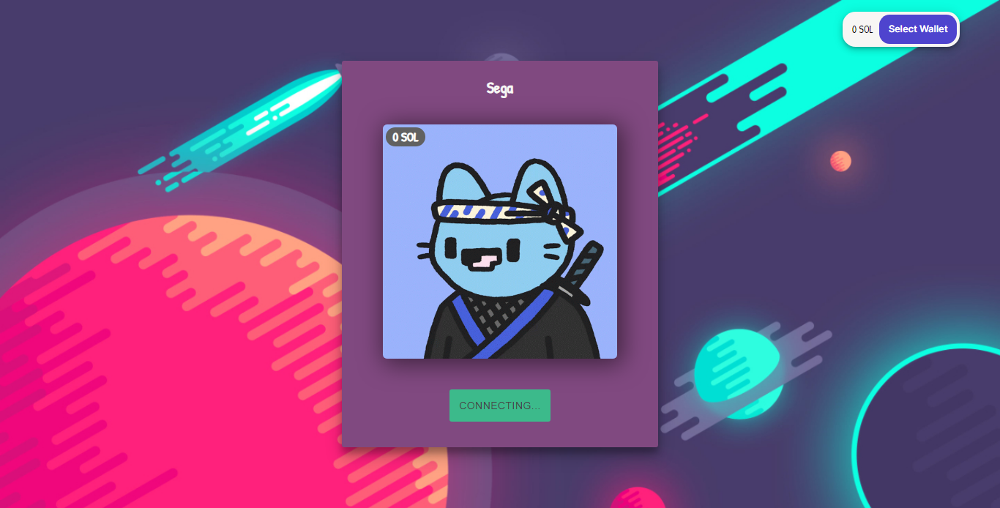
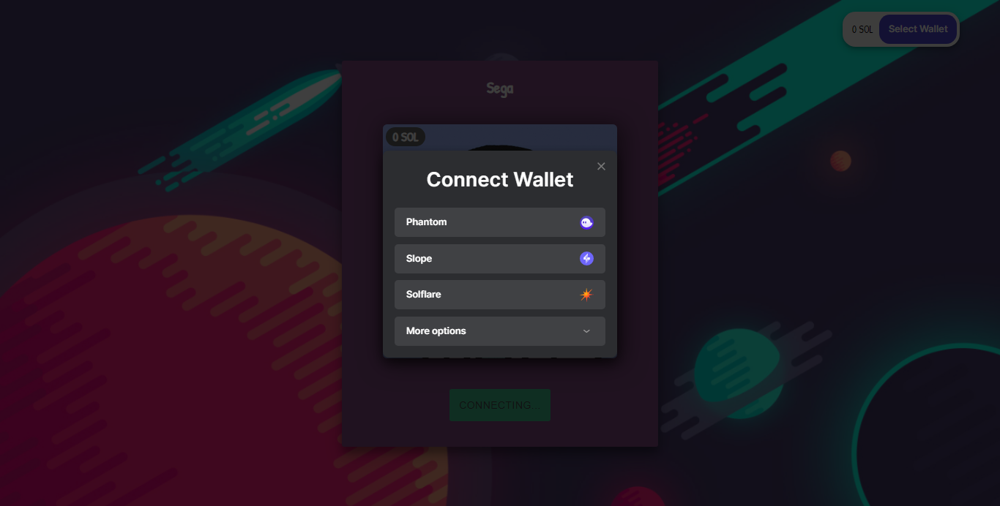
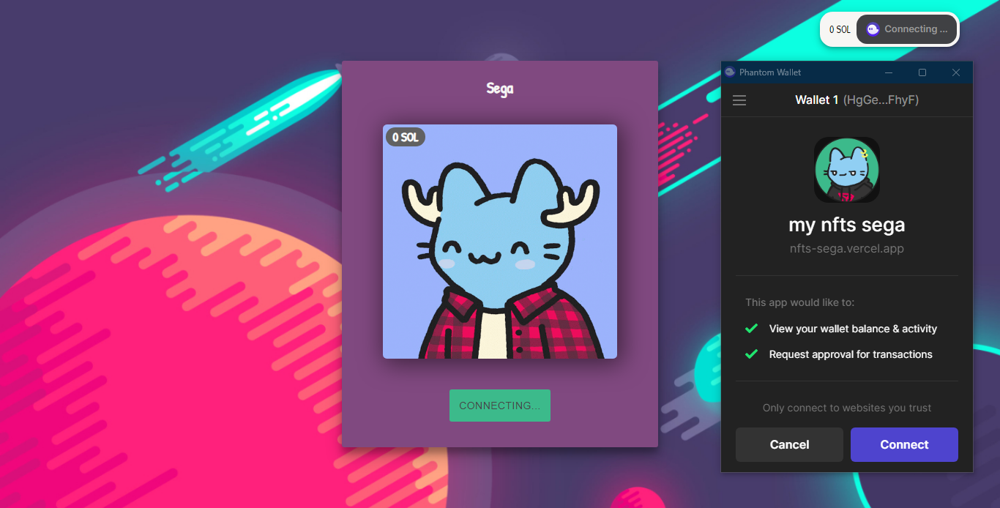
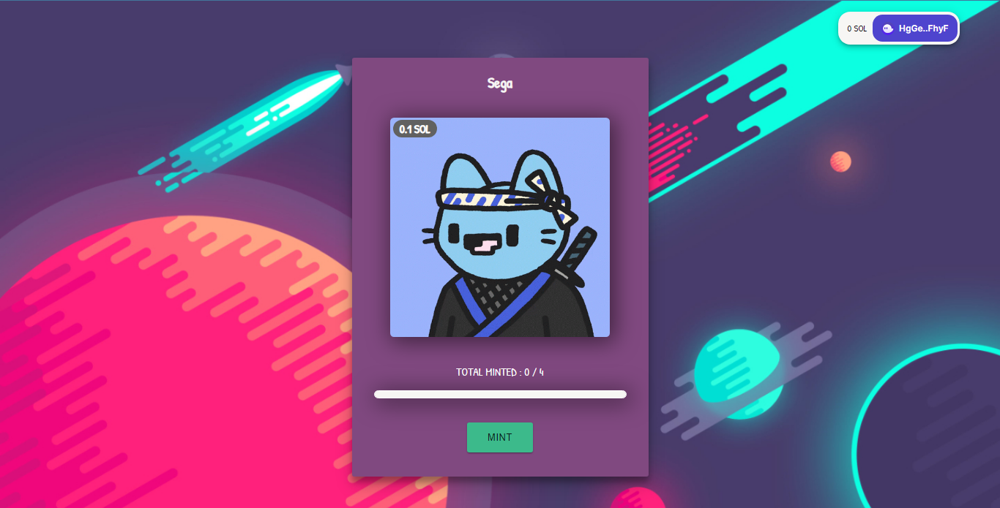

# Sega Nfts

Nfts arts collections, deployed on the Solana blockchain

<div>
   
<div>
   
<div>
   
<div>
   

# Live version

This project is deployed on [Vercel](https://nfts-sega.vercel.app/)

## Feedback and Bugs

If you have any feedback or bug report, please feel free to raise an issue :)

### Installation

1. Clone the repo
   ```sh
   git clone https://github.com/JavSFDev/sega-nfts
   ```
1. Install NPM packages
   ```sh
   yarn install
   ```
1. Enter your Solana API key in a `.env` in your root directory
   ```js
   REACT_APP_CANDY_MACHINE_ID=token
   REACT_APP_SOLANA_NETWORK=devnet
   REACT_APP_SOLANA_RPC_HOST=https://api.devnet.solana.com
   REACT_APP_SPL_TOKEN_TO_MINT_NAME=token mint name
   REACT_APP_SPL_TOKEN_TO_MINT_DECIMALS=token
   ```

<!-- USAGE EXAMPLES -->
## Usage

You can use any Solana wallet to mint the token. E.g: **Phantom**, **Slope**, **Solflare**, **Sollent**, **Solong**, **Ledger**, **Safepal**
